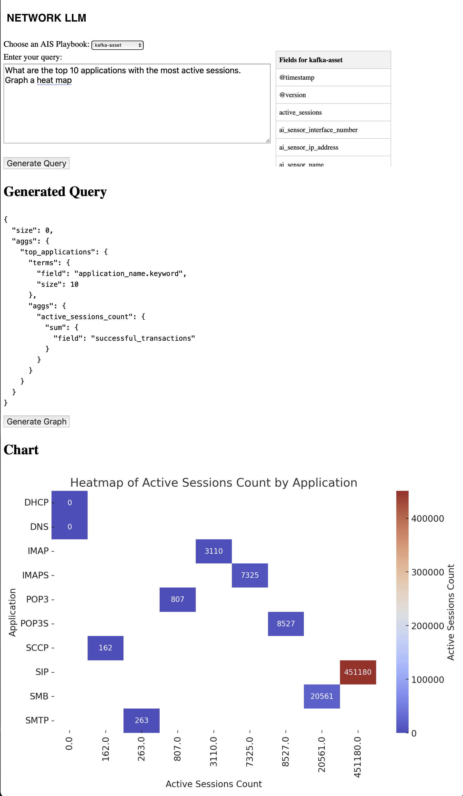
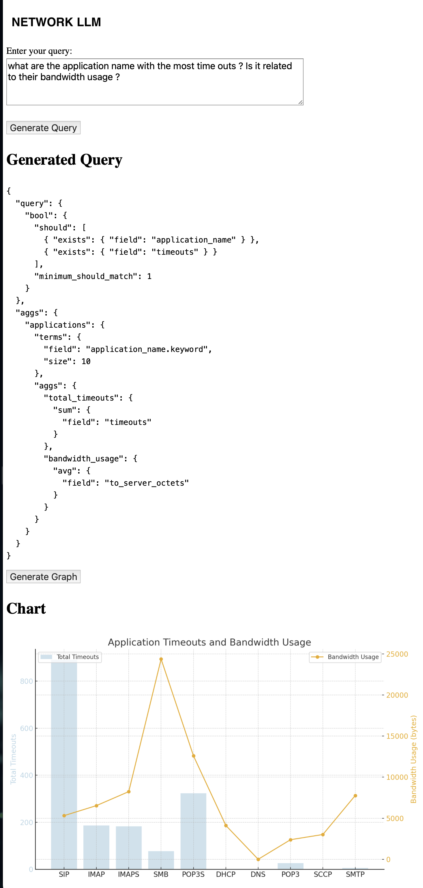

# 🧠 LLM-driven Query Assistant for Elasticsearch

This project transforms natural language questions into executable Elasticsearch queries, with automatic visualization. It's designed for real-world operational data — such as observability, security, or infrastructure metrics — and serves as a lightweight agent prototype powered by LLMs.

## 🎯 Goal

Help users explore large, complex datasets without needing to write code or understand the schema.  
The system:
- Receives a natural language question
- Sends a structured prompt to an LLM (via OpenAI API)
- Receives a JSON query structure
- Executes it on Elasticsearch
- Renders the results as charts

## 💡 Example Queries

- **Top applications by session count:**
  > "What are the top 10 applications with the most active sessions? Graph a heat map."

- **Timeouts vs bandwidth:**
  > "What are the application name with the most time outs? Is it related to their bandwidth usage?"

## 🧱 Architecture

```
User (browser)
   ↓
[Flask App: ntsctAI.py]
   ↳ Generates prompt
   ↳ Sends to OpenAI
   ↳ Parses and validates response (JSON)
   ↳ Queries Elasticsearch (via ElasticTools)
   ↳ Displays chart (via chart_util)
```

## 🗂️ Key Files

- `ntsctAI.py`: Main logic (UI, LLM prompt, ES query, chart rendering)
- `prompt_1.txt`, `prompt_2.txt`: Prompt templates to guide query generation
- `ElasticTools.py`: Executes ES queries
- `chart_util.py`: Plots results using matplotlib/seaborn

## 🚀 Getting Started

1. Clone the repo:
```bash
git clone https://github.com/Fromzy1/ntsctAI2.git
cd ntsctAI2
```

2. Install dependencies:
```bash
pip install -r requirements.txt
```

3. Create a `.env` file:
```
OPENAI_API_KEY=your-key-here
ELASTIC_HOST=http://localhost:9200
ELASTIC_INDEX=kafka-asset
```

4. Run the app:
```bash
python ntsctAI.py
```

Then visit `http://localhost:5000` in your browser.

## 📊 Screenshots

<!-- Markdown-style heading -->
## Visualization Examples

<!-- HTML-style images for size control -->
<div align="center">
  
  
</div>


## 🛣️ Roadmap

- [ ] Agent-based modularization (e.g. trend agent, anomaly agent)
- [ ] Support for open-source models (e.g. llama.cpp, Ollama)
- [ ] Schema introspection via plugin tools (e.g. MCP)
- [ ] Docker packaging

## 🙋 Who is this for?

- Data engineers and security analysts exploring LLM usage in observability
- Builders of lightweight AI agents grounded in structured data
- Anyone looking to prototype reasoning workflows on top of time-series or telemetry

## 📄 License

MIT

